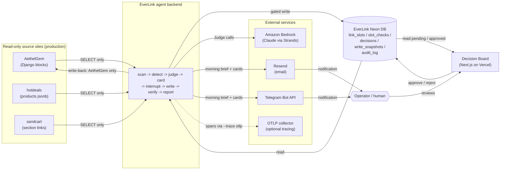
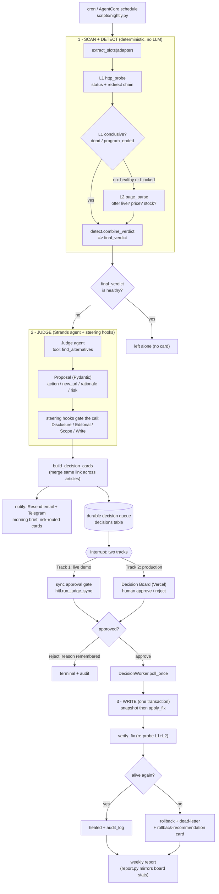
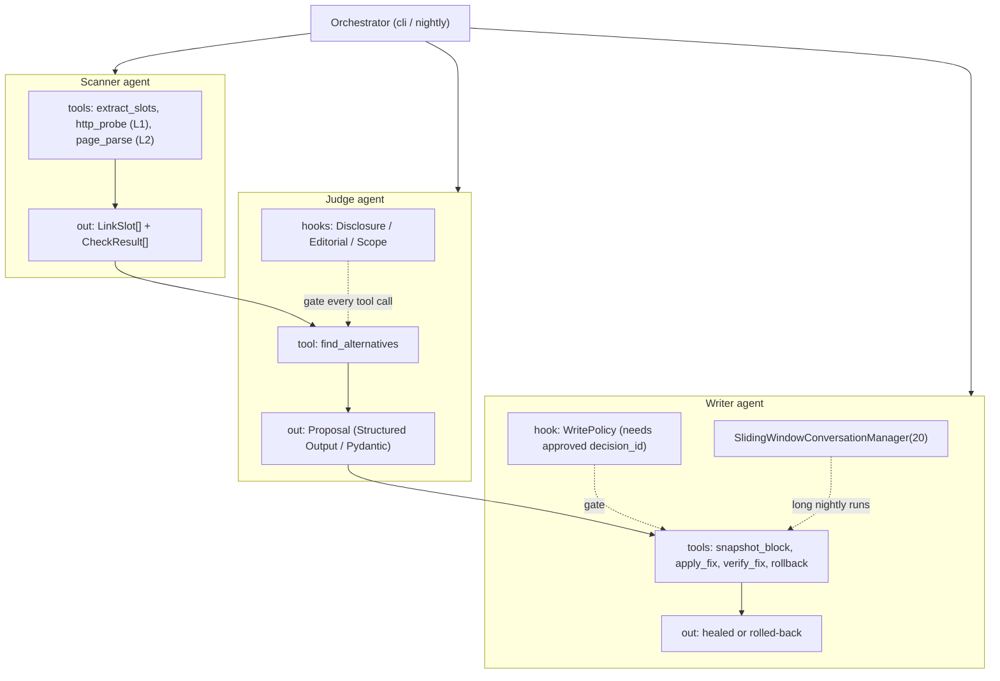
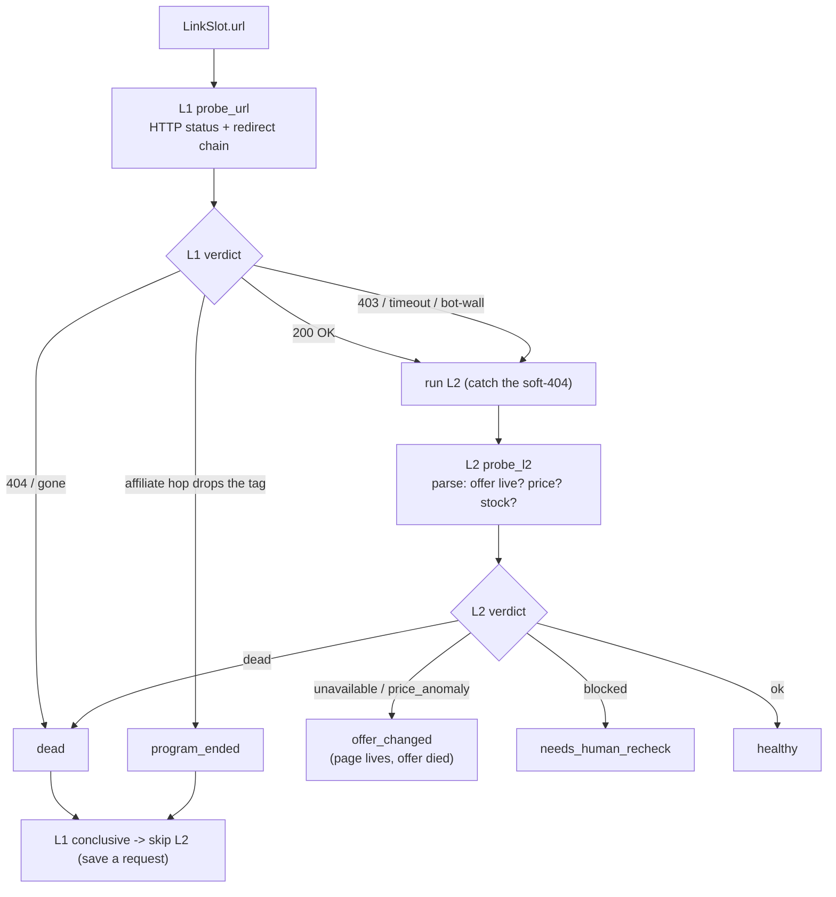
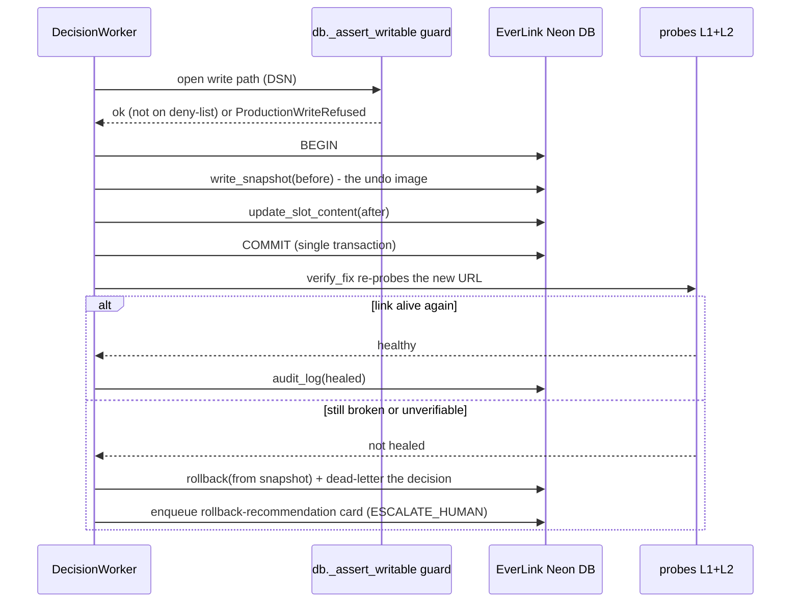
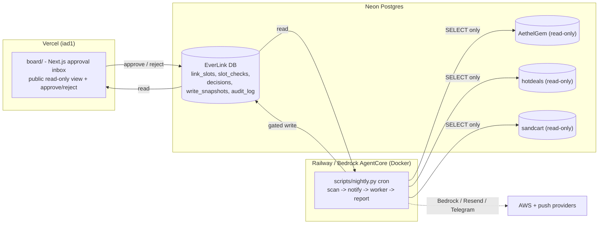

# EverLink Architecture

EverLink is an autonomous **link-rot steward**: a nightly agent patrols every outbound
link slot of a content/affiliate site, *detects* rot with deterministic probes, *decides*
a fix with an LLM Judge bounded by steering policies, *surfaces* a decision card only when
a human is needed, and — once approved — *writes back + verifies* the fix in one
transaction. This document is the map; [`README.md`](README.md) is the pitch,
[`DEPLOYMENT.md`](DEPLOYMENT.md) is the runbook, [`EVALS_REPORT.md`](EVALS_REPORT.md) is
the evidence.

> Diagrams are Mermaid (rendered natively by GitHub). Every box below corresponds to a
> real module in [`everlink/`](everlink) — nothing is aspirational.

---

## 1. System context

The three source databases are opened **read-only** (`SET default_transaction_read_only =
on`); the only write path is the gated Writer against AethelGem block content, and the
production Blue-Neon instance is on a hard deny-list (see §6).

The three source sites (`aethelgem` / `hotdeals` / `sandcart`) are the maintainer's
dogfooding EXAMPLE keys — `sandcart` is the internal codename for the FlashDeals
storefront. A deployer substitutes their own site keys, databases and origins; no site
identity or domain is hardcoded in the agent.

---

## 2. The nightly pipeline (end to end)

---

## 3. Agent topology (Agent-as-Tool, not a Swarm)

The task is a **sequential dependency chain**, so EverLink composes agents as tools rather
than a peer Swarm. All agents are `strands.Agent`s over a `BedrockModel`
(`StubModel` offline), built in [`everlink/agents.py`](everlink/agents.py).

| Strands feature | Where it is used |
|---|---|
| `@tool` | `extract_slots` / `http_probe` / `page_parse` / `find_alternatives`; Writer's `snapshot_block` / `apply_fix` / `verify_fix` / `rollback` |
| Multi-agent (Agent-as-Tool) | Orchestrator → Scanner → Judge → Writer |
| Steering | `DisclosurePolicy` / `EditorialPolicy` / `ScopePolicy` ([`steering.py`](everlink/steering.py)) |
| Hooks (Before/AfterToolCall) | write gate + `audit_log` ([`steering.py`](everlink/steering.py)) |
| Interrupt | sync gate + durable queue ([`hitl.py`](everlink/hitl.py)) |
| Structured Output (Pydantic) | `Proposal` ([`model.py`](everlink/model.py)) |
| ConversationManager (SlidingWindow) | Writer, long nightly runs |
| Strands Evals | 50-case suite ([`evals.py`](everlink/evals.py), [`EVALS_REPORT.md`](EVALS_REPORT.md)) |
| `BedrockModel` | Claude via Amazon Bedrock ([`llm.py`](everlink/llm.py)) |
| OpenTelemetry | optional tracing ([`tracing.py`](everlink/tracing.py)) |

---

## 4. Detection pyramid (the deterministic heart)

Detection is **pure code — no LLM** ([`detect.py`](everlink/detect.py)), so it is fully
testable offline and is the metric the Evals harness scores for real. L2 is spent only
where L1 is inconclusive (`_L2_ESCALATE = healthy | needs_human_recheck`).

`combine_verdict(l1, l2)` is the single folding rule shared by the Scanner tool, the
`everlink scan` CLI, and the Evals oracle — so a demo replay can never drift from
production detection.

---

## 5. Write-back safety (one transaction, snapshot-first, verified)

Guardrails ([`db.py`](everlink/db.py)): every write/DDL first calls `_assert_writable`,
which refuses any DSN whose host matches a source-site connection var or the
`EVERLINK_FORBIDDEN_HOSTS` deny-list. The production Blue-Neon instance can never be
written, even by accident.

---

## 6. Data & deployment

---

## 7. Module map

| Layer | Modules | Responsibility |
|---|---|---|
| Ingest | `adapters.py`, `generic.py`, `model.py` | site → `LinkSlot` (read-only); generic crawl/sitemap adapter; shared schemas |
| Detection | `probes.py`, `l2.py`, `detect.py` | L1 HTTP + redirect chain; L2 page parse; `combine_verdict` oracle |
| Agents | `agents.py`, `llm.py` | Scanner / Judge / Writer (`@tool`s); `BedrockModel` + `StubModel` |
| Steering | `policy.py`, `steering.py` | disclosure / editorial / scope / write policies as hooks + a pure oracle |
| Surfacing | `cards.py`, `queue.py`, `hitl.py`, `notify.py`, `board/` | decision-card merge; durable queue; two-track interrupt; Resend + Telegram; approval inbox |
| Write-back | `writer.py`, `db.py` | snapshot → apply → verify → rollback in one transaction; guarded write primitives + `audit_log` |
| Reporting | `report.py` | weekly report (mirrors the board's `weeklyStats`) |
| Evals / demo | `evals.py`, `fixtures.py`, `tracing.py`, `seed.py` | 50-case harness; fixture server; optional OTel; deterministic demo replay |
| Entrypoints | `cli.py`, `scripts/nightly.py`, `scripts/run_evals.py`, `scripts/seed_demo.py`, `scripts/export_slots.py` | `everlink scan/notify/worker/report`; cron; evals; seed; read-only export |
